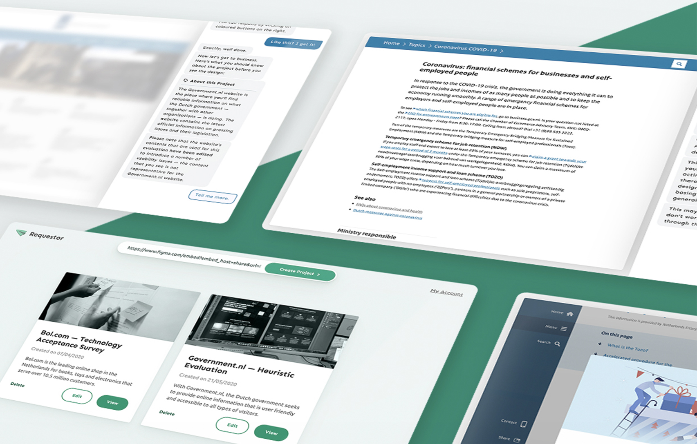

# Requestor (working title)

This is a web application that is used to share Figma works-in-progress for evaluation with others. For this demonstration, an UX Evaluation of the Dutch e-commerce site known as [Bol.com](https://bol.com) is used. However, this will probably be changed to something less copyright intensive as this project continues.

Check out [a demo](https://ajgeel.github.io/requestor/) of the latest build.

## Easier Sharing of Works-in-progress

With this tool, UX Designers can more easily share their works-in-progress with their (Non UX-designer) colleagues, and provide them with actionable instructions in order to provide feedback. The functionality of this application will be linked with the [Evaluator](https://github.com/AJGeel/figma-sample-plugin) Plugin for Figma in the future.

The purpose of this project is to help address problems related to [UX Maturity](https://scholar.google.com/scholar?hl=en&as_sdt=0,5&q=ux+maturity) in business by providing enterprise with the tools to understand the role of UX.

## Evaluation Methods

Currently, the plugin contains placeholders that will support the following UX Evaluation methods in future releases:

| Abbreviation | Method | Reference |
| / | ------------ | ------------- |
| N.A. | Jakob Nielsen's Usability Heuristics | [Source](https://pdfs.semanticscholar.org/5f03/b251093aee730ab9772db2e1a8a7eb8522cb.pdf) |
| TAM | Technology Acceptance Model | Coming soon.. |
| SUS | System Usability Scale | Coming soon.. |
| UEQ | User Experience Questionnaire | Coming soon.. |
| UEQ-S | Short User Experience Questionnaire | Coming soon.. |
| / | Mark Hassenzahl's AttrakDiff |  Coming soon.. |
| / | Perspective-Based Inspection |  Coming soon.. |
| / | Visual Aesthetics of Websites Inventory |  Coming soon.. |
| SUPR-Q | Standardized User Experience Percentile Rank Questionnaire |  Coming soon.. |
| NPS | Net Promoter Score | Coming soon.. |
| SMEQ | Subjective Mental Effort Questionnaire |  Coming soon.. |
